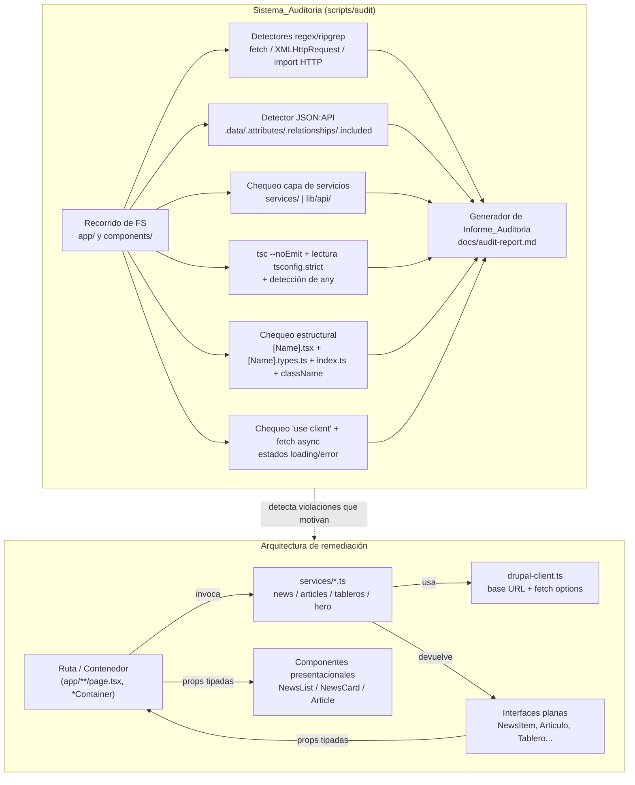

# Documento de Diseño: Auditoría y Remediación de la Arquitectura Frontend

## Overview

Este diseño cubre dos capacidades complementarias sobre el proyecto `web_institucional_frontend` (Next.js 16.3.4 App Router, React 19, TypeScript 5 con `strict: true`, Tailwind CSS 4, `framer-motion` y `next-drupal` v2 sobre Drupal JSON:API):

1. **Sistema_Auditoria** — un proceso repetible de análisis estático que inventaría rutas, componentes y módulos de datos, detecta incumplimientos de las cinco reglas de `AGENTS.md` y de la skill de estandarización, y produce el **Informe_Auditoria** en Markdown (`docs/audit-report.md`).
2. **Arquitectura de remediación** — una **Capa_Servicios** compartida en `services/`, modelada exactamente sobre el patrón ya correcto de `components/ti/tableros.ts`, más la descomposición de componentes en presentacionales/contenedores y la estandarización estructural.

El objetivo es que, tras la remediación, la **Verificacion_Conformidad** (`tsc --noEmit` limpio + `eslint` limpio en archivos modificados + comprobación estructural) confirme que el código cumple las reglas.

### Estado actual (evidencia)

| Elemento | Estado | Evidencia |
|---|---|---|
| `tsconfig.json` `strict` | ✅ Cumple (Req 4.3) | `"strict": true` presente en `compilerOptions` |
| Alias `@/*` → `./*` | ✅ Disponible | `paths` en `tsconfig.json`; una carpeta raíz `services/` importa con `@/services/...` |
| `lib/drupal.ts` | ⚠️ Solo instancia `new NextDrupal(...)`, no hay capa de servicios | archivo de 6 líneas |
| `components/ti/tableros.ts` | ⚠️ Patrón correcto pero ubicado mal | usa `server-only`, tipos planos, mappers privados, `getTablerosData(): Promise<TablerosData>` con `hasError` |
| `components/home/heroData.ts` | ⚠️ Patrón correcto pero ubicado mal | `getHeroSlides(): Promise<HeroSlide[]>`, mismo patrón que tableros |
| `components/home/NewsSection.tsx` | ❌ Viola reglas 1 y 2 | tipos JSON:API en línea, `fetch("/jsonapi/node/news")`, `resolveNewsImageUrl`, mapeo y render en un solo archivo |
| `app/[...slug]/page.tsx` | ❌ Viola reglas 1 y 2 | tipos JSON:API en línea, `fetch` directo en `generateStaticParams` y en la página, resolución de URL de imagen inline |
| `components/home/` | ❌ Viola skill / Req 5 | estructura plana, barrel único compartido, sin `[Name].types.ts`, sin carpeta por componente |

### Mapa de secciones ↔ requisitos

- Sección **Arquitectura del Sistema_Auditoria** → Requisitos 1, 2, 3, 4, 5, 6, 7.
- Sección **Arquitectura de remediación (Capa_Servicios)** → Requisitos 8, 9.
- Sección **Separación presentacional/contenedor** → Requisitos 9, 11.
- Sección **Estandarización de componentes** → Requisitos 5, 10.
- Sección **Estados de carga y error** → Requisitos 6, 11.
- Sección **Estilos y Verificacion_Conformidad** → Requisito 12.

---

## Architecture

### Diagrama general (auditoría + flujo de datos remediado)



### Componentes de la Capa_Servicios (destino)

```
services/
  drupal-client.ts     # resolveServerBaseUrl() + getFetchOptions() compartidos (import "server-only")
  news.ts              # getNews(): Promise<NewsResult>
  articles.ts          # getArticleBySlug(...) + getArticleParams() para [...slug]
  tableros.ts          # reubicación de components/ti/tableros.ts (comportamiento preservado)
  hero.ts              # reubicación de components/home/heroData.ts
  types.ts             # (opcional) interfaces planas compartidas y tipos de resultado
```

Se elige `services/` (raíz) sobre `lib/api/` porque el alias `@/*` ya resuelve a `./*`, de modo que `import { getNews } from "@/services/news"` funciona sin configuración adicional. Ambos son válidos según el Requisito 8.1; el diseño estandariza `services/`.

---

## Components and Interfaces

### 1. Sistema_Auditoria

Enfoque **pragmático y repetible**: un proceso de análisis estático ejecutable como script Node/TS bajo `scripts/audit/` (o, como mínimo, un conjunto de comandos documentados). No requiere ejecutar la app; opera sobre el árbol de archivos.

Pasos del proceso:

1. **Recorrido de FS** de `app/` y `components/` recolectando `page.tsx`, `.tsx` y `.ts` (Req 1). Si `app/` no existe o no tiene `page.tsx`, se registra la ausencia y se continúa (Req 1.2).
2. **Detección de red** (Req 2.1): regex/ripgrep para `\bfetch\s*\(`, `XMLHttpRequest`, e imports de clientes HTTP (`axios`, `next-drupal` usado directamente en componentes visuales). Se registra archivo + línea de cada ocurrencia.
3. **Detección JSON:API** (Req 2.2): acceso a `.data` / `.attributes` / `.relationships` / `.included` como propiedad. Se registra archivo + línea.
4. **Clasificación e inventario** (Req 1.5, orden estricto): si tiene red → módulo de datos; si gestiona estado o compone otros componentes → contenedor; si no → presentacional.
5. **Chequeo Capa_Servicios** (Req 3): existencia de `services/` o `lib/api/`; módulos de datos fuera de la capa (p. ej. `components/ti/tableros.ts`, `components/home/heroData.ts`) se marcan severidad media con ruta actual y ruta destino recomendada; funciones que devuelvan JSON:API sin transformar → severidad media.
6. **Chequeo de tipado** (Req 4): `tsc --noEmit` + lectura de `tsconfig.compilerOptions.strict`; detección de `any` explícito/implícito y props sin `interface`/`type`.
7. **Chequeo estructural** (Req 5): por componente, existencia de `[Name].tsx`, `[Name].types.ts`, `index.ts` que exporte el componente y `className?: string` opcional en props.
8. **Chequeo de estados** (Req 6): en archivos con `'use client'`, detectar obtención asíncrona en cliente (`useEffect` + `fetch`/promesa cuyo resultado va al estado) y verificar presencia de rama de carga y rama de error.
9. **Generación del Informe** (Req 7): agrupado por regla, en Markdown.

Manejo de errores de análisis: si un archivo no existe, no se puede leer o no es texto válido, se registra la omisión con motivo y se continúa (Req 2.5, 5.6, 3.5).

### 2. Capa_Servicios remediada

Cada módulo de servicio replica el patrón de `tableros.ts`:

- `import "server-only";` al inicio.
- Tipos JSON:API **parciales y privados** (no exportados).
- **Mappers privados puros** (`mapX`) que transforman recurso JSON:API → interface plana.
- **Fetchers privados** (`fetchX`) que construyen la URL, hacen `fetch` con opciones de caché y lanzan en `!response.ok`.
- **Función pública** que devuelve interfaces planas y **señala error mediante valor de retorno tipado** (`hasError` o unión discriminada), sin filtrar JSON:API (Req 8.3–8.5, 9.4).

`services/drupal-client.ts` centraliza la lógica duplicada hoy en tres archivos:

```ts
// services/drupal-client.ts
import "server-only";

export function resolveServerBaseUrl(): string {
  const isServerInsideDocker = Boolean(
    process.env.DRUPAL_BASE_URL &&
      !process.env.NEXT_PUBLIC_DRUPAL_BASE_URL?.includes("localhost"),
  );
  return (
    (isServerInsideDocker
      ? process.env.DRUPAL_BASE_URL
      : process.env.NEXT_PUBLIC_DRUPAL_BASE_URL) ||
    process.env.DRUPAL_BASE_URL ||
    "http://localhost:8080"
  );
}

export function getFetchOptions(): RequestInit {
  const isDev = process.env.NODE_ENV === "development";
  return isDev ? { cache: "no-store" } : { next: { revalidate: 3600 } };
}

export function resolvePublicAssetUrl(relativePath: string): string {
  const publicBaseUrl =
    process.env.NEXT_PUBLIC_DRUPAL_BASE_URL || "http://localhost:8080";
  try {
    return new URL(relativePath, publicBaseUrl).toString();
  } catch {
    return relativePath;
  }
}
```

Interfaz pública de `services/news.ts`:

```ts
// services/news.ts
import "server-only";
import { getFetchOptions, resolveServerBaseUrl, resolvePublicAssetUrl } from "@/services/drupal-client";
import type { NewsItem, NewsResult } from "@/services/news.types";

// tipos JSON:API parciales y privados aquí ...
// mapNewsResource(...) privado ...

export async function getNews(): Promise<NewsResult> {
  // fetch + map; ante fallo -> { items: [], hasError: true }
}
```

### 3. Descomposición presentacional / contenedor

**NewsSection (antes)** — un único archivo mezcla tipos JSON:API, `fetch`, `resolveNewsImageUrl`, mapeo y render.

**NewsSection (después)**:
- `services/news.ts` posee tipos JSON:API, mappers, `getNews()`.
- `NewsSection` pasa a ser **contenedor** (server component): llama a `getNews()`, decide entre datos reales y fallback según `hasError`, y renderiza el presentacional.
- `NewsList` / `NewsCard` son **presentacionales**: reciben `NewsItem[]` por props (incluyendo `className?`), sin red ni JSON:API (Req 9.1–9.3).

Before/after abreviado:

```tsx
// ANTES (components/home/NewsSection.tsx) — viola reglas 1 y 2
type DrupalNewsResponse = { data?: ...; included?: ... };  // JSON:API en el componente
async function getNews() { const r = await fetch("/jsonapi/node/news", ...); /* map inline */ }
export default async function NewsSection() { const news = await getNews(); return (/* render */); }

// DESPUÉS
// services/news.ts  -> getNews(): Promise<NewsResult>   (JSON:API encapsulado)
// components/home/NewsSection/NewsSection.tsx (contenedor)
export default async function NewsSection({ className }: NewsSectionProps) {
  const { items, hasError } = await getNews();
  const news = hasError || items.length === 0 ? fallbackNews : items;
  return <NewsList items={news} className={className} />;
}
// components/news-list/NewsList.tsx (presentacional): solo props tipadas
```

**Página de artículo `[...slug]`**: la ruta (contenedor) llama a `services/articles.ts` (`getArticleBySlug` para la página y `getArticleParams` para `generateStaticParams`), recibe un `Articulo` plano y renderiza un presentacional `Article` que solo consume props. La ruta mantiene `notFound()` cuando el servicio señala ausencia.

### 4. Estandarización de componentes (Estructura_Componente)

Estructura obligatoria por componente:

```
components/news-list/
  NewsList.tsx        # lógica y UI
  NewsList.types.ts   # interfaces de props/estado (incluye className?: string)
  index.ts            # barrel: export { default as NewsList } from "./NewsList";
```

Migración de `components/home/*` (hoy plano con barrel único): cada sección (`HeroSection`, `NewsSection`, `EnrollmentSection`, etc.) pasa a su carpeta con los tres archivos. `useSwipe.ts` y `home.module.css` se mantienen encapsulados junto a sus consumidores (el CSS module puede quedar por componente o compartido según uso). El barrel `components/home/index.ts` se conserva reexportando desde las nuevas carpetas, de modo que las importaciones existentes (`@/components/home`) no se rompen; las importaciones directas a archivos se actualizan (Req 10.5).

---

## Data Models

### Modelo de hallazgo e informe (Sistema_Auditoria)

```ts
type Severidad = "alta" | "media" | "baja";

type ReglaArquitectura =
  | "1-separacion-responsabilidades"
  | "2-capa-servicios"
  | "3-tipado-estricto"
  | "4-componentizacion"
  | "5-estilos"
  | "skill-estandarizacion"
  | "estados-carga-error";

interface Hallazgo {
  regla: ReglaArquitectura;
  archivo: string;        // ruta relativa al proyecto
  linea?: number;         // línea de la primera ocurrencia, si aplica
  severidad: Severidad;
  descripcion: string;    // qué se detectó
  remediacion: string;    // acción recomendada
}

interface Omision {
  archivo: string;
  motivo: string;         // no existe / no legible / no es texto válido
}

interface ItemInventario {
  archivo: string;
  categoria: "modulo-datos" | "componente-contenedor" | "componente-presentacional";
  rutaAsociada?: string;  // page.tsx para rutas
}

interface InformeAuditoria {
  inventario: ItemInventario[];
  hallazgosPorRegla: Record<ReglaArquitectura, Hallazgo[]>;
  omisiones: Omision[];
  reglasCumplidas: ReglaArquitectura[]; // reglas sin hallazgos (Req 7.5)
}
```

Formato del **Informe_Auditoria** (`docs/audit-report.md`): secciones por regla, cada hallazgo con archivo, línea, severidad y remediación; sección de inventario; sección de omisiones; y para cada regla sin hallazgos, una línea explícita "Regla cumplida" (Req 7.1–7.5).

### Interfaces planas de dominio (Capa_Servicios)

```ts
// services/news.types.ts
export interface NewsItem {
  id: string;
  title: string;
  description: string;
  image: string;   // URL absoluta ya resuelta
  alt: string;
  href: string | null;
}
export interface NewsResult {
  items: NewsItem[];
  hasError: boolean;   // señalización tipada de fallo, sin JSON:API (Req 8.5)
}

// services/articles.types.ts
export interface Articulo {
  id: string;
  title: string;
  bodyHtml: string | null;   // body.processed ya extraído
  createdAt: string;         // ISO
  posterUrl: string | null;
  posterAlt: string;
}
export type ArticuloResult =
  | { status: "ok"; articulo: Articulo }
  | { status: "not-found" }
  | { status: "error" };     // unión discriminada, sin filtrar JSON:API
export interface ArticuloParam { slug: string[] }
```

`Tablero`, `CategoryNode`, `TablerosData` y `HeroSlide` se conservan tal cual al reubicar `tableros.ts` y `heroData.ts` a `services/` (comportamiento preservado, Req 9.4).

---

## Correctness Properties

*Una propiedad es una característica o comportamiento que debe cumplirse en todas las ejecuciones válidas del sistema — una afirmación formal sobre lo que el sistema debe hacer. Las propiedades son el puente entre las especificaciones legibles por humanos y las garantías de corrección verificables por máquina.*

Este diseño incluye dos superficies con lógica pura verificable por propiedades: (a) los **mappers JSON:API → interfaces planas** de la Capa_Servicios (funciones puras, entrada estructurada, espacio de entrada amplio) y (b) los **detectores del Sistema_Auditoria** sobre contenido de texto. Ambos cumplen el criterio "para todo input X, la propiedad P(X) se cumple". La UI (render Tailwind/CSS modules), la configuración de caché y la verificación de infraestructura Drupal no son aptas para PBT y se cubren con pruebas de ejemplo/integración en la Testing Strategy.

### Property 1: El mapeo nunca filtra estructura JSON:API

*Para cualquier* respuesta JSON:API válida (incluyendo `included`/`relationships` arbitrarios), el objeto plano producido por el mapper de un servicio (`NewsItem`, `Articulo`, `Tablero`, `HeroSlide`) SOLO contiene las claves definidas por su Interface_Plana y ninguna de `data`/`attributes`/`relationships`/`included`.

**Validates: Requirements 8.3, 8.4, 9.2**

### Property 2: Señalización de error tipada ante fallo

*Para cualquier* fallo de red o respuesta con error del backend, la función pública del servicio devuelve un valor de resultado tipado que indica el error (`hasError: true` o rama de la unión discriminada distinta de `ok`) sin lanzar hacia el componente ni exponer JSON:API.

**Validates: Requirements 8.5**

### Property 3: Resolución de URL de imagen es determinista y absoluta o nula

*Para cualquier* referencia de archivo e `included`, `resolvePublicAssetUrl`/el resolutor de imagen del servicio devuelve una URL absoluta bien formada cuando existe el recurso, o `null` cuando no existe, y aplicar la resolución dos veces sobre la misma entrada produce el mismo resultado (idempotencia sobre la entrada).

**Validates: Requirements 8.3, 9.2**

### Property 4: El detector de red identifica toda ocurrencia con su línea

*Para cualquier* archivo de texto que contenga N ocurrencias de `fetch(`, `XMLHttpRequest` o import de cliente HTTP, el detector reporta exactamente N hallazgos, cada uno con el número de línea correcto, y 0 hallazgos cuando no hay ninguna.

**Validates: Requirements 2.1, 2.3**

### Property 5: Asignación de severidad consistente con la regla

*Para cualquier* componente visual analizado, la severidad asignada es "alta" si existe petición HTTP directa, "media" si hay acceso JSON:API sin petición HTTP directa, y "baja" en cualquier otro caso dentro del alcance del Requisito 2 — exactamente uno de {alta, media, baja}.

**Validates: Requirements 2.4**

### Property 6: Clasificación de inventario mutuamente excluyente y ordenada

*Para cualquier* elemento inventariado, se asigna exactamente una categoría aplicando el orden: módulo de datos → contenedor → presentacional; un elemento con red siempre se clasifica como módulo de datos con independencia de que además componga componentes.

**Validates: Requirements 1.5**

*(Reflexión de propiedades: se descartaron propiedades redundantes — p. ej. "el objeto plano contiene el título" y "el objeto plano contiene la descripción" quedan subsumidas en la Property 1 sobre el conjunto exacto de claves; la propiedad de "round-trip" completo de serialización no aplica porque el mapeo JSON:API→plano es intencionadamente lossy, por lo que se verifica la ausencia de fuga de estructura en su lugar.)*

---

## Error Handling

### Sistema_Auditoria
- Archivo inexistente / no legible / no textual: registrar `Omision` con motivo y continuar (Req 2.5, 5.6).
- `app/` ausente o sin `page.tsx`: registrar ausencia de rutas y continuar (Req 1.2).
- Directorio raíz inaccesible: registrar imposibilidad de completar el chequeo de Capa_Servicios preservando los resultados previos (Req 3.5).

### Capa_Servicios (remediación)
- `fetch` con `!response.ok` o excepción de red: capturar en la función pública y devolver resultado tipado de error (`hasError: true` / rama `error`), registrando en `console.error` con contexto, sin propagar JSON:API (Req 8.5). Es el patrón ya presente en `tableros.ts` y `heroData.ts`.

### Componentes
- **Server components con fallback** (`NewsSection`, `HeroSection`): el contenedor decide entre datos del servicio y datos de reserva según el resultado tipado; no muestran estado de carga porque se resuelven en render de servidor (Req 6.4 — no aplica loading/error de cliente).
- **Ruta de artículo**: `notFound()` cuando el servicio devuelve `not-found`; para `error`, `notFound()` o página de error según convención de la ruta.
- **Contenedores de cliente** (`'use client'` con fetch async, si se introducen): deben renderizar Estado_Carga mientras la promesa está pendiente y Estado_Error cuando falla (Req 11.1–11.2), y el presentacional con datos aplanados al éxito (Req 11.3).

Nota sobre `NewsSection`: hoy es server component con `fallbackNews`. Tras la remediación sigue siendo server component; la señalización `hasError` del servicio se mapea a UI eligiendo `fallbackNews`. No se convierte en cliente salvo que se requiera interactividad asíncrona, en cuyo caso aplicarían loading/error del Requisito 11.

---

## Testing Strategy

### Enfoque dual
- **Property-based tests** para lógica pura: mappers de servicios y detectores de auditoría.
- **Unit tests de ejemplo** para casos concretos y edge cases.
- **Integration/smoke tests** para lo que depende de Drupal o del sistema de archivos real.

### Configuración PBT
- Librería: `fast-check` con el runner de test del ecosistema (Vitest o el runner que el proyecto adopte); no se implementa PBT desde cero.
- Mínimo **100 iteraciones** por test de propiedad.
- Cada test de propiedad se etiqueta con un comentario: **Feature: audit-frontend-architecture, Property {n}: {texto}**.
- Cada propiedad de la sección Correctness Properties se implementa con un **único** test de propiedad.

### Qué se prueba con propiedades
- **Mappers** (`mapNewsResource`, mapeo de artículo, `mapTablero`, `mapResourceToSlide`): generadores de recursos JSON:API arbitrarios (con `included`/`relationships` variados) verifican Property 1 (sin fuga de estructura), Property 3 (URL absoluta o `null`, idempotente). Los mappers son funciones puras, por lo que se exportan de forma testeable (o se prueban vía la función pública con `fetch` mockeado).
- **Señalización de error** (Property 2): con `fetch` mockeado para fallar, la función pública devuelve el resultado de error tipado.
- **Detectores de auditoría** (Property 4, 5, 6): generadores de contenido de archivo sintético con N ocurrencias verifican conteo y líneas; generadores de perfiles de componente verifican severidad y clasificación.

### Qué se prueba con ejemplos / integración (no PBT)
- Render de `NewsList`/`NewsCard`/`Article` presentacionales: snapshot/ejemplo (Tailwind + CSS modules), no PBT.
- Existencia de `services/`, estructura por componente y `strict: true`: chequeos estructurales de ejemplo.
- Conectividad real con Drupal JSON:API: 1–3 integration tests representativos.

### Verificacion_Conformidad (Req 12)
La remediación se considera verificada cuando:
1. `tsc --noEmit` finaliza sin errores (modo estricto ya activo).
2. `npm run lint` (`eslint`) se ejecuta sin errores sobre los archivos modificados.
3. La comprobación estructural confirma que cada componente remediado tiene `[Name].tsx`, `[Name].types.ts`, `index.ts` y `className?: string` opcional.
4. No se introducen dependencias visuales nuevas (se mantienen Tailwind + CSS modules + `framer-motion` existentes).
